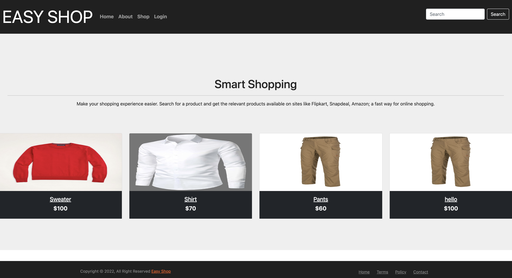
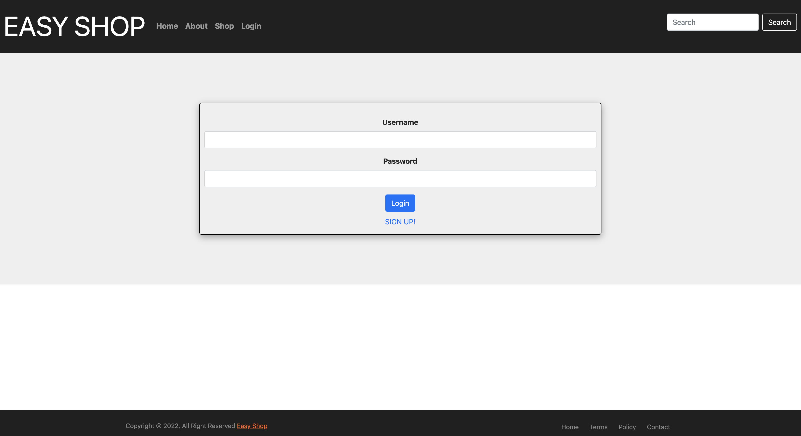
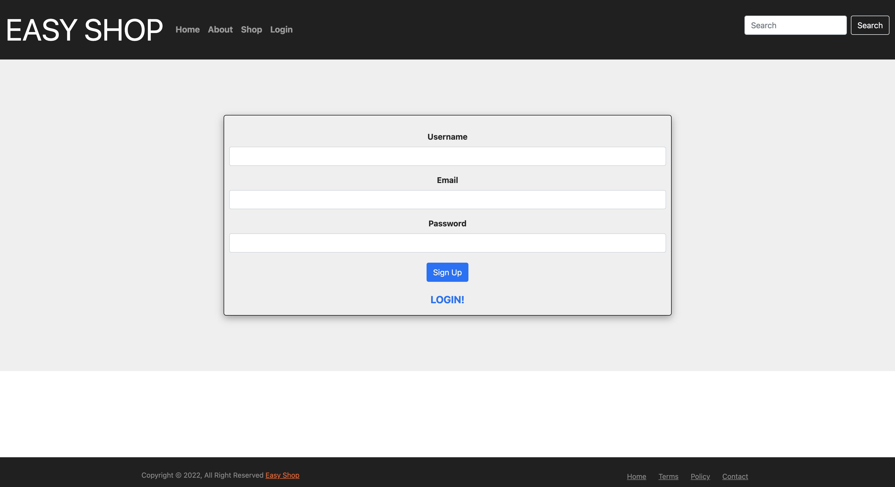
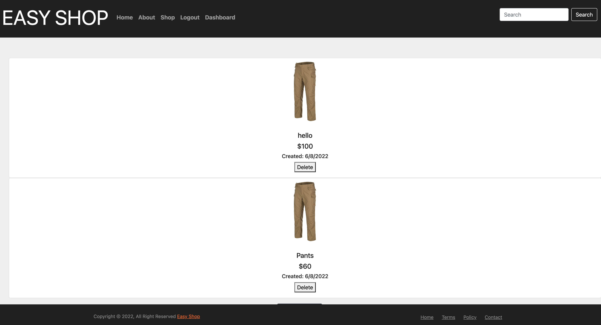
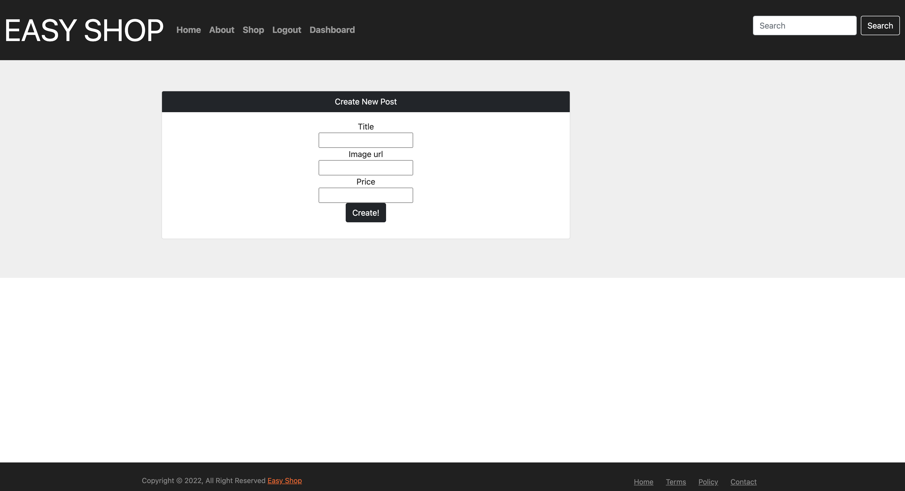

# Easy-Shop

## Table of Concept

- [Description](#description)
- [Installation](#installation)
- [Database](#database)
- [NPM Packages](#packages)
- [Github](#github)
- [Hekou](#heroku)
- [Screenshot](#screenshot)

## Description

Easy Shop is a user friendly website used for buying and selling items. Users are able to create accounts and post their items.

## Installation

To install the application dependencies run following command:

```console
$ npm i
```

## Database

You will need to populate the database. Use the db/seeds file to pupulate

```console
$ npm run seed
```

## Packages

Following NPM packages used in this project, also found in the package.json file.

- sequelize
- express
- express-handlebars
- express-session
- myslq2
- doetnv
- connect-session-sequelize
- bcrypt

## Github

- url - https://github.com/Easy-Shop/Easy-Shop

## Heroku

- url - https://secure-reaches-05381.herokuapp.com/

## Screenshot


Homepage



Login Page



Sign Up Page



Dashboard



New Post



[Back To Top](#easy-shop)
